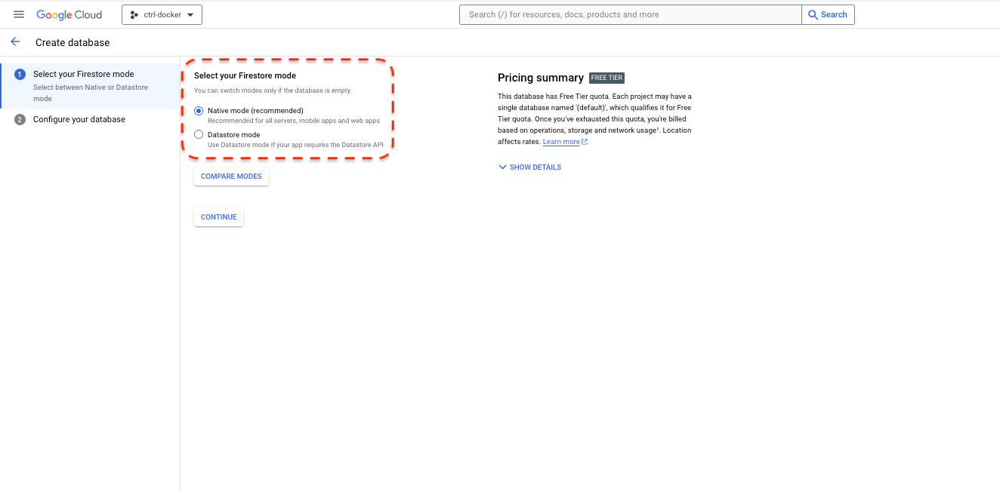
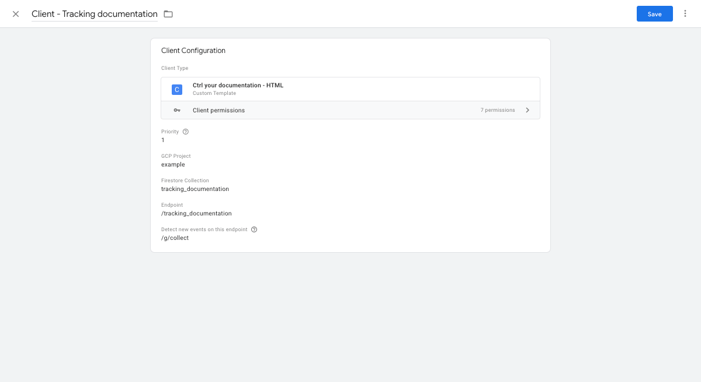
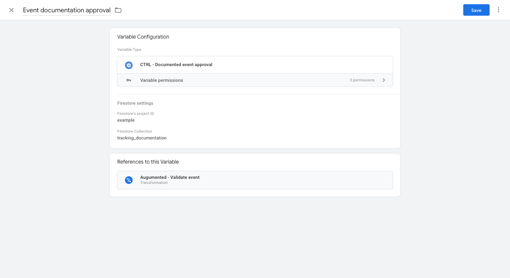
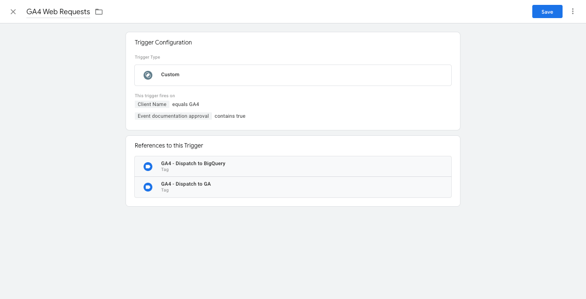

# CTRL Your Documentation
## Purpose
In GTMS there's two added custom templates:
- CTRL Your Documentation client template
- Validate event variable template

The data for the documentation is stored in Google Cloud's Firestore. Each event is it's own document within a Firestore collection.

If needed, the setup can collect and store previously undocumented events for possible missed documentation. This data will be stored in the document *Undocumented* with the request parameters populated as a subfield for each undocumented event. 
## Setup
The process is straight forward:
1. Create a Firestore collection with a placeholder setup. Firestore must be set in `Native Mode`. If you've created Firestore previously and it's not in `Native Mode`, you must delete all data to be able to reconfigure it. Else just create a new project.
2. Download the templates found in this GitHub project.
3. Set up the templates in Google Tag Manager according to your details.
4. Modify the behaviour of all tags, if the quality assurance feature is to be used.
### Create Firebase datastore
Native mode

### Create client
Start by heading into [/gtm-templates](/gtm-templates) and download the client `.tpl` file. Once downloaded, open the Google Tag Manager server side account in mind and do the following:
1. On the left hand side, click `Templates`
2. In the top most section, Client Templates, create a new by clicking `New`
3. Enter the menu, upper right corner, and `Import` a new template
4. Choose the downloaded client `.tpl` file and save.

See example configuration below:

### Create variable
Start by heading into [/gtm-templates](/gtm-templates) and download the variable `.tpl` files. Once downloaded, open the Google Tag Manager server side account in mind and do the following:
1. On the left hand side, click `Templates`
2. In the top most section, Client Templates, create a new by clicking `New`
3. Enter the menu, upper right corner, and `Import` a new template
4. Choose the downloaded variable `.tpl` file and save.

See example configuration below:

### Modify 
Create a transformation if wanted. This produces a new augmented row in every event data object generated by the assigned client(s). It adds the value from the variable with either `true` or `false` depending on the received parameters comply with the documentation.

Add this as a trigger exception and your data quality will increase.

