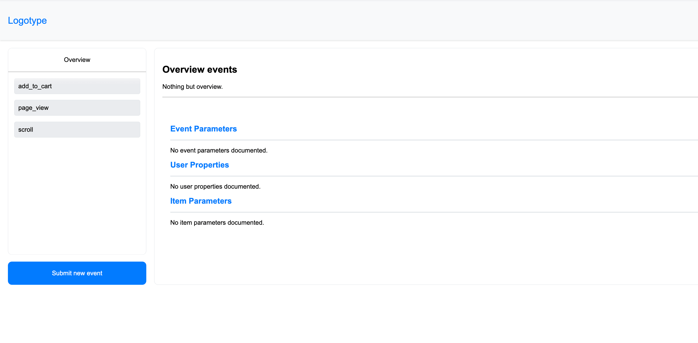
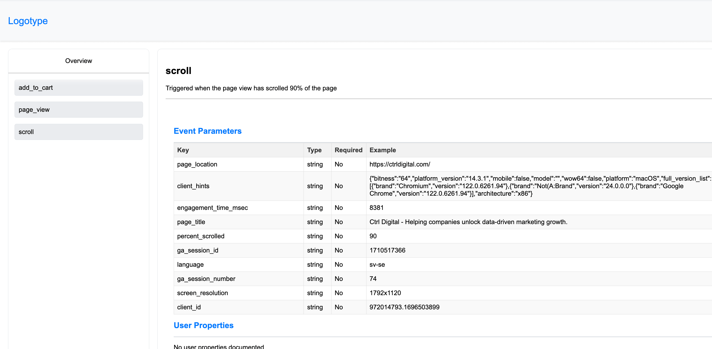
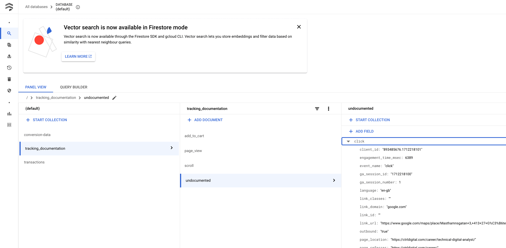

# Automated documentation – Let go of the chore
Looking for a cost-effective alternative to Segment's Protocol and Snowplow's data quality tools? Google Tag Manager (GTM) server-side offers a robust solution that rivals these premium services without the opaque pricing. Both pricey solutions as they're behind the, oh so casual, "Talk to us to know more" price level. I, myself, don't like booking sales demos so I'll go ahead and show you what you can do instead as an unique way of using Google Tag Manager server side and a "simple" HTML string.

Server side Google Tag Manager is a crucial cog in the pipeline of improved tracking for more advanced analytics and better ad spending. It manages distribution from a consolidated data stream to multiple recipients. It serves as a gatekeeper which can allow all data to proceed through to platform X but limited data to proceed to platform Y. It can enrich data collected by appending CRM data, it can convert sales value to margins instead of order value, it can evaluate if the visit was bot generated or not. It's the little server that could. There's practically no limitation of what you can do if you've got a developer by your side.

So why not trash the manually updated Sheet where all event names are listed? Along with all parameters, if the parameters are required, descriptions of the parameter, description of the events, data type, comments of old problems – never ending rows containing cells with text which no one reads. It's such a clear use case for Google Tag Manager to handle all the documentation. Let the server react to undocumented events and store them conveniently for you to add. Make sure Google Tag Manager uses it gatekeeping potential to validate all events before they're sent out to each platform. Let the server host it own documentation and you can update any undocumented events directly from the UI.

Set it up, and let your data quality improve. Make sure colleagues get an overview of what's collected. Redirect developers to understand how parameters should be formated. Have it effortlessly hosted with no more Google Sheets links, no local and outdated Excel sheets, nor Confluence pages with never ending nesting in the outline.
## How to create a documentation
Using Google Cloud's Firestore service, Google Tag Manager can query a collection and read the data. This data can be anything; conversions which happened in the past but just only now proceeded to be confirmed sales, profit margins for all purchased items, click ids from previous ad clicks, or data which specifies how the tracking is set up. See the possibilities?

Start with creating a Firestore collection. Important for the Firestore service to be set in `Native mode`, in contrast to the Datastore mode, as the API used by GTM requires it. For each document in this collection, its name corresponds to the documented event name and add the necessary parameters to document. 


## How to show documentation
There's a need for a good looking UX; no more spreadsheets to look nor tables in documents. In this example, we'll use a client in Google Tag Manager server side. Why? Because we can. Because now everything is hosted and controlled within the same Google Tag Manager interface. Now, everything is configured and hosted in the same UI. Finally, because it's fun to push the limits of what's reasonable to assign Google Tag Manager to do.

You'll need a custom client in Google Tag Manager for this to work. It'll respond to the URL of the UI. Example: sgtm.example.com/tracking_documentation. Whenever a colleague visits the URL, a request is made to Firestore which fetches the documentation, the client then populates a HTML string with all the responded events and parameters, and finally returns all data as a HTML string to be visualised by the browser along with javascript and CSS as inline code. Here we have a complete interface of a tracking document provided by nothing but Google Tag Manager.

 

The interface exposes all documented events and their parameters assigned. The events are easily overviewed and it's easy for a developer to get a grasp of what data is needed for an event to properly fire. A new analyst can quickly get a grasp of all collected events and their parameters with example values and descriptions. 


### How to create automated documentation
Automated might be a strong word for it. It's actively listening on all pre-specified paths for new requests. Whenever a new request arrives, the custom client reads the request and passes it on to be ***claimed by another client***. Very important the last part. This client shouldn't claim any requests made to the tracking endpoint as this is handled by the ordinary client. This means that the priority needs to be adjusted to be greater than the ordinary claiming client!

This documentation client reads the request and checks against its Firestore database. If the incoming request has all its event registered then the client waits for the next request to be made. If a request contains an event which is not documented, then the custom client springs into action by grabbing the event name along with all the parameters. This data is written to Firestore under the document *Undocmented* (or whatever, I'm not in charge) and each entry is an object with the event name as a key and the parsed event data object as a nested object as value. This collects all the events received at the endpoint and enables for easier mapping of new events when it's time to update the documentation.



This in turn can be expressed in the UI. With a clear signal that the documentation is out of date. Perhaps a call to action button to update the documentation? A low effort, auto population of most fields makes the up-to-date ambition of the tracking documentation almost as easy as to misconfigure GA4 (thanks, Google.)


## Why not take this one step further with some quality assurance?
When the documentation is complete and everything is up and running, now it's time to get fine-grain control of all collected data: validation before write. When a request is parsed into an event data object, tags are more than thrilled to start firing and sending data according to an immaculate server side tagging setup (good job you!) We need a way to make sure the data is clean and according to the documentation before sending it to our analytics endpoint. This is a first step of your machine learning journey: quality assured data.

With some simple Firestore variables and a transformation we can make this happen. The transformation isn't strictly necessary but it's great for observability and if you're writing the event data object directly to storage, a data click stream, it's great for debugging and having the validation in post processing.

There's always the prebuilt Firestore variable available in Google Tag Manager. However, it lacks a cache control. If there's a lot of traffic through the server container it might not be the best solution as it will read a lot from Firestore. [It's still cheap](https://cloud.google.com/firestore/pricing), but unnecessary if it would exceed the free tier. 

So let's do it the fun way! Create a custom variable template and lets reuse the code from the previous client template which *also benefits greatly of having a cache*. This variable will return a `truthy` or `falsey` value for which you'll append its response to the event data object with the help of a Google Tag Manager transformation. Once there, set up an exception trigger to prevent tags from firing when an event either isn't up to date regarding `Required` parameters sent or previously documented.

```js
const cachedContent = templateDataStorage.getItemCopy('firestoreData') || {},
	lastFetch     = templateDataStorage.getItemCopy('lastFetched') || 0,
	maxDayOldData = getTimestampMillis() - (24 * 60 * 60 * 1000);

Promise.all([
	Promise.create((resolve, reject) => {
	    if (!cachedContent || maxDayOldData > lastFetch) {
          resolve(Firestore.query(
            collection, 
            [], 
            { projectId: projectId, limit: 10000 }
          ).then().catch(error => {
            if (getType(error) === 'object') {
              log('Error likely due to a document with a key without value. Populate all documents and keys in Firestore and try again.');
            } else {
              log(error);
            }
          })); 
        } else {
          log('Documentation: Read data from cache.');
          resolve();
        }
      }),
    cachedContent
    ]).then( //TODO: the code
```
## Example code
Head over to [our GitHub page](https://github.com/ctrl-digital) and download the `.tpl` files and get going! The code is available as soon as it has been deemed functional.
## Final words
Tracking documentation is a worrisome area for all implementers. It's difficult to structure, it's difficult to keep clean. It's time consuming to maintain and even more so to keep the tracking implementation in line with documented values whenever the site changes. When everyone follows the documentation, which is a feat just by itself, it's the issue with varians in collected data quality. A solution like this can really improve the quality of your work and make it easier to communicate implemented tracking, onboard colleagues, and lay the foundation of your ML journey.

